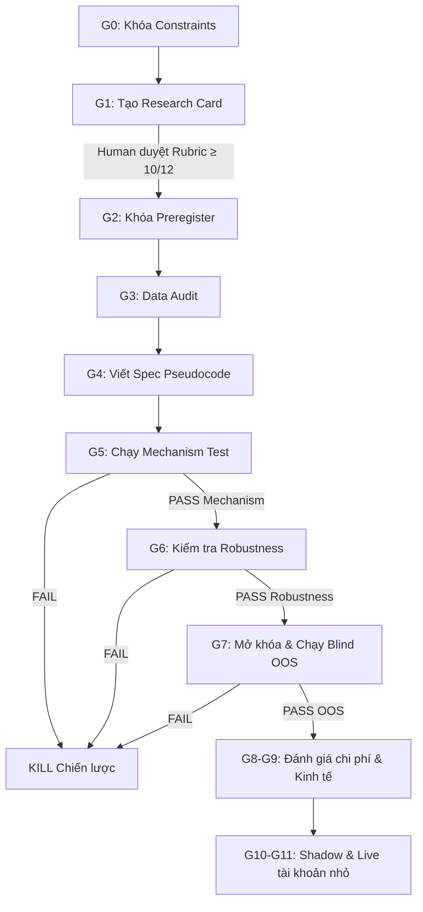

Listed directory research
Viewed README.md:1-41
Viewed AI_CONSTITUTION.md:1-41
Listed directory prompts
Listed directory cards
Listed directory prereg
Viewed constraints.yaml:1-106
Viewed decision_log.md:1-19
Viewed G1_research_card.md:1-26
Viewed G2_preregister.md:1-18
Viewed G4_implementation_spec.md:1-35
Viewed G5_mechanism_and_budget.md:1-20
Viewed EVAL_prompt_md.md:1-159
Viewed _TEMPLATE.md:1-94
Viewed _TEMPLATE.md:1-96

Chào bạn, dưới đây là giải thích chi tiết về tất cả các file trong thư mục [research](file:///c:/Users/Vu/Documents/vscode/ea/new/research) và quy trình (flow) sáng tạo chiến lược tự động mới mà chúng ta sẽ áp dụng từ nay về sau.

---

### I. Giải thích chi tiết các file trong folder `research`

Thư mục này được thiết kế theo cấu trúc **"Cổng kiểm soát nghiêm ngặt" (Gated Process)** nhằm ngăn chặn tình trạng tối ưu hóa quá đà (overfitting) và tự lừa dối bản thân (curve-fitting).

#### 1. Các file cấu hình và tài liệu chính
*   [AI_CONSTITUTION.md](file:///c:/Users/Vu/Documents/vscode/ea/new/research/AI_CONSTITUTION.md) (Hiến pháp AI):
    *   **Vai trò**: Văn bản bắt buộc phải đưa vào đầu mọi session nghiên cứu.
    *   **Nội dung**: Định hình AI làm việc như một nhân lực nghiên cứu định lượng độc lập (laborer) thay vì người viết pitch deck quảng cáo. Thiết lập tư duy mặc định là **KILL** chiến lược trừ khi có bằng chứng thuyết phục, cấm dùng Martingale/Grid, cấm tối ưu hóa trên tập Holdout/OOS, cấm ngụy biện bằng tên tuổi tác giả.
*   [constraints.yaml](file:///c:/Users/Vu/Documents/vscode/ea/new/research/constraints.yaml) (Khóa ràng buộc cứng):
    *   **Vai trò**: Được bạn (Human) cấu hình và khóa lại **trước khi** bắt đầu nghiên cứu một ý tưởng.
    *   **Nội dung**: Quy định chặt chẽ về Symbol (XAUUSD), Timeframe (M15, H1), Khung giờ giao dịch, Risk model (max DD 15%), Mô hình chi phí thực tế (spread, slippage, commission), các phân vùng dữ liệu (Discovery, Validation, Holdout) và các tiêu chuẩn tối thiểu để pass (Kill Floors).
*   [decision_log.md](file:///c:/Users/Vu/Documents/vscode/ea/new/research/decision_log.md) (Nhật ký quyết định):
    *   **Vai trò**: Ghi chép lịch sử PASS/KILL/REWORK của từng ý tưởng.
    *   **Nội dung**: Theo dõi sức khỏe của quy trình. Tỷ lệ KILL ở G1 cao là dấu hiệu tốt (chứng tỏ ta lọc ý tưởng rác sớm trước khi tốn tài nguyên chạy backtest).
*   [README.md](file:///c:/Users/Vu/Documents/vscode/ea/new/research/README.md):
    *   **Vai trò**: Sách hướng dẫn cách sử dụng thư mục `research`, quy định thứ tự các Gate từ G0 đến G11 và các điều cấm kỵ.

#### 2. Thư mục prompts (Chứa các prompt tương ứng với từng Gate)
*   [prompts/EVAL_prompt_md.md](file:///c:/Users/Vu/Documents/vscode/ea/new/research/prompts/EVAL_prompt_md.md): Bản đánh giá chỉ ra lỗi sai của file `prompt.md` cũ (di sản). Việc dùng prompt cũ làm bạn dễ bị overfit vì nó cho phép AI tự chọn symbol/TF, tự chọn tham số và nhảy thẳng vào viết code trước khi test cơ chế cốt lõi. File này phân tích lý do tại sao phải chia nhỏ quy trình.
*   [prompts/G1_research_card.md](file:///c:/Users/Vu/Documents/vscode/ea/new/research/prompts/G1_research_card.md): Prompt yêu cầu AI chỉ viết ý tưởng nghiên cứu sơ khởi (Research Card) dựa trên cơ chế kinh tế rõ ràng, không code, không backtest.
*   [prompts/G2_preregister.md](file:///c:/Users/Vu/Documents/vscode/ea/new/research/prompts/G2_preregister.md): Prompt hướng dẫn tạo tài liệu đăng ký thử nghiệm (Preregistration), khóa chặt các metrics và phương pháp kiểm chứng trước khi chạy bất kỳ phép tối ưu nào.
*   [prompts/G4_implementation_spec.md](file:///c:/Users/Vu/Documents/vscode/ea/new/research/prompts/G4_implementation_spec.md): Prompt viết đặc tả kỹ thuật chi tiết (pseudocode, công thức toán) cho chiến lược.
*   [prompts/G5_mechanism_and_budget.md](file:///c:/Users/Vu/Documents/vscode/ea/new/research/prompts/G5_mechanism_and_budget.md): Prompt hướng dẫn chạy thử nghiệm cơ chế cốt lõi (Mechanism test) và giới hạn ngân sách biến thể trên tập dữ liệu Discovery.

#### 3. Các thư mục dữ liệu và template
*   `cards/`: Chứa các Research Card của các chiến lược. Có file template mẫu tại [cards/_TEMPLATE.md](file:///c:/Users/Vu/Documents/vscode/ea/new/research/cards/_TEMPLATE.md).
*   `prereg/`: Chứa các file Preregistration của chiến lược. Có file template mẫu tại [prereg/_TEMPLATE.md](file:///c:/Users/Vu/Documents/vscode/ea/new/research/prereg/_TEMPLATE.md).
*   `audits/`: Chứa báo cáo kiểm tra tính toàn vẹn của dữ liệu đầu vào (Data Audit - G3).
*   `results/`: Lưu trữ các kết quả kiểm thử, biểu đồ, mã nguồn kiểm tra cơ chế và báo cáo cuối cùng từ G5 đến G9.

---

### II. Quy trình sáng tạo chiến lược tự động mới (Flow G0 → G11)

Quy trình mới sẽ tuân thủ nghiêm ngặt **12 bước (Gate)** dưới đây. Bất kỳ sự nhảy cóc hoặc vi phạm nào đều sẽ dẫn đến việc **KILL** chiến lược đó ngay lập tức:

#### Chi tiết từng bước thực hiện:

1.  **G0 — Constraint Lock (Người dùng làm)**: 
    *   Bạn khóa file [constraints.yaml](file:///c:/Users/Vu/Documents/vscode/ea/new/research/constraints.yaml) (`status: LOCKED`). AI không được tự ý sửa đổi universe/timeframe/cost model sau bước này.
2.  **G1 — Research Card (AI thực hiện - Ý tưởng)**:
    *   Dán [AI_CONSTITUTION.md](file:///c:/Users/Vu/Documents/vscode/ea/new/research/AI_CONSTITUTION.md) + [constraints.yaml](file:///c:/Users/Vu/Documents/vscode/ea/new/research/constraints.yaml).
    *   Sử dụng prompt [G1_research_card.md](file:///c:/Users/Vu/Documents/vscode/ea/new/research/prompts/G1_research_card.md) để viết ý tưởng thô vào `research/cards/YYYYMMDD-###.md` (dựa trên template).
    *   *Yêu cầu*: Trả lời được 3 câu hỏi cốt lõi: **Ai trả tiền? Tại sao họ chịu thua? Tại sao cơ hội này chưa bị triệt tiêu?**
    *   *Quyết định*: Bạn chấm điểm theo Rubric (dưới cùng của file card). Nếu $\ge 10/12$ điểm $\rightarrow$ **PASS** $\rightarrow$ Đi tiếp. Ngược lại $\rightarrow$ **KILL**.
3.  **G2 — Preregistration (AI thực hiện - Khóa quy trình)**:
    *   Sử dụng prompt [G2_preregister.md](file:///c:/Users/Vu/Documents/vscode/ea/new/research/prompts/G2_preregister.md) để viết vào `research/prereg/YYYYMMDD-###.md`.
    *   Khóa duy nhất 1 Metric chính (ví dụ: `expectancy_R_after_cost`), danh sách các biến thể tham số dự kiến sẽ test (không được thêm ngoài danh sách này) và bài test cơ chế lõi (Mechanism test).
    *   Bạn ký tên khóa tài liệu (`status: LOCKED`) trước khi chạy bất kỳ code test nào.
4.  **G3 — Data Audit (Kiểm thử dữ liệu)**:
    *   Kiểm tra chất lượng file data lịch sử (có bị mất nến, sai múi giờ, bad tick không). Ghi nhận kết quả vào `research/audits/`.
5.  **G4 — Implementation Spec (AI thực hiện - Đặc tả thuật toán)**:
    *   Sử dụng prompt [G4_implementation_spec.md](file:///c:/Users/Vu/Documents/vscode/ea/new/research/prompts/G4_implementation_spec.md).
    *   Viết đặc tả logic Entry/Exit, SL/TP, Friction filter dưới dạng toán học và pseudocode. **Tuyệt đối chưa viết code thực thi.**
6.  **G5 — Mechanism Test & Limited Discovery (AI chạy code test)**:
    *   Sử dụng prompt [G5_mechanism_and_budget.md](file:///c:/Users/Vu/Documents/vscode/ea/new/research/prompts/G5_mechanism_and_budget.md).
    *   Viết code Python chỉ để kiểm tra cơ chế lõi (ví dụ: hiệu quả của tín hiệu mua/bán so với ngẫu nhiên) trên tập Discovery.
    *   Nếu Mechanism Test **FAIL** $\rightarrow$ **KILL** ngay lập tức. Không cố gắng tối ưu hóa để cứu.
    *   Nếu **PASS** $\rightarrow$ Chạy backtest giới hạn các biến thể đã khai báo ở G2 trên tập Discovery.
7.  **G6 — Robustness Battery (AI thực hiện - Đo độ bền vững)**:
    *   Chạy chiến lược trên tập Validation với các bài test stress: Thay đổi tham số $\pm20\%$, Stress test chi phí nới rộng lên $1.5\times$ và $2\times$, loại bỏ $5\%$ lệnh thắng lớn nhất, dịch trễ lệnh $1$ nến (entry delay), hoán vị ngẫu nhiên (permutation).
8.  **G7 — Blind OOS (Chạy tập dữ liệu mù)**:
    *   Khi tất cả kiểm tra G6 đạt chuẩn, bạn ký mở khóa tập dữ liệu Holdout (`opened: true` trong constraints).
    *   Chạy kiểm thử chiến lược trên tập Holdout đúng **1 lần duy nhất** (OOS test). Không được sửa bất kỳ tham số hay bộ lọc nào sau khi có kết quả OOS.
    *   Nếu kết quả OOS dưới ngưỡng tối thiểu $\rightarrow$ **KILL**.
9.  **G8 → G11 — Costs, Economics, Shadow & Live**:
    *   Đánh giá chi phí trượt giá thực tế (G8), phân bổ vốn/kế hoạch rủi ro tài khoản (G9). Ghi nhận quyết định cuối cùng vào [decision_log.md](file:///c:/Users/Vu/Documents/vscode/ea/new/research/decision_log.md).
    *   Khi tất cả đều đạt, lúc này mới được phép code EA bằng MQL5 ở thư mục gốc để chạy thử nghiệm trên tài khoản demo/shadow (G10) và live vốn nhỏ (G11).

---
### Tóm tắt công việc đã thực hiện:
*   Phân tích cấu trúc thư mục [research](file:///c:/Users/Vu/Documents/vscode/ea/new/research) và vai trò của từng file.
*   Làm rõ sự khác biệt và điểm yếu của file `prompt.md` cũ so với quy trình Gated mới thông qua [EVAL_prompt_md.md](file:///c:/Users/Vu/Documents/vscode/ea/new/research/prompts/EVAL_prompt_md.md).
*   Tổng hợp sơ đồ và chi tiết các bước trong quy trình sáng tạo chiến lược tự động mới (từ G0 đến G11) để áp dụng đồng bộ từ nay về sau.